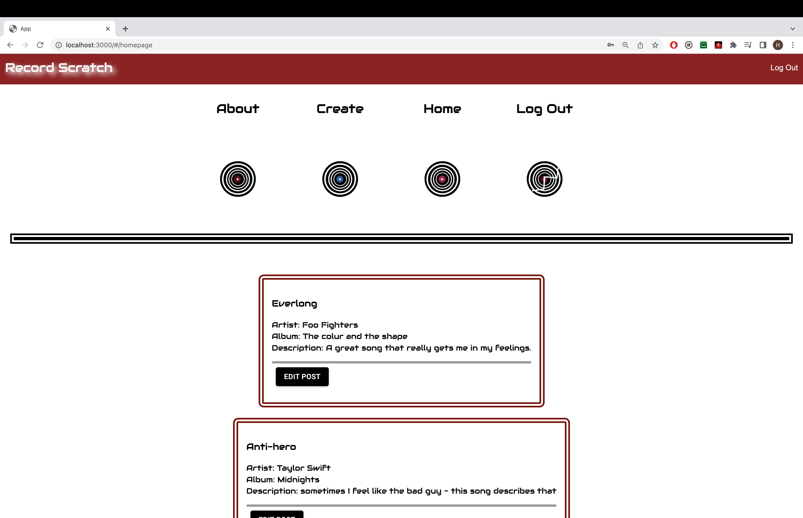
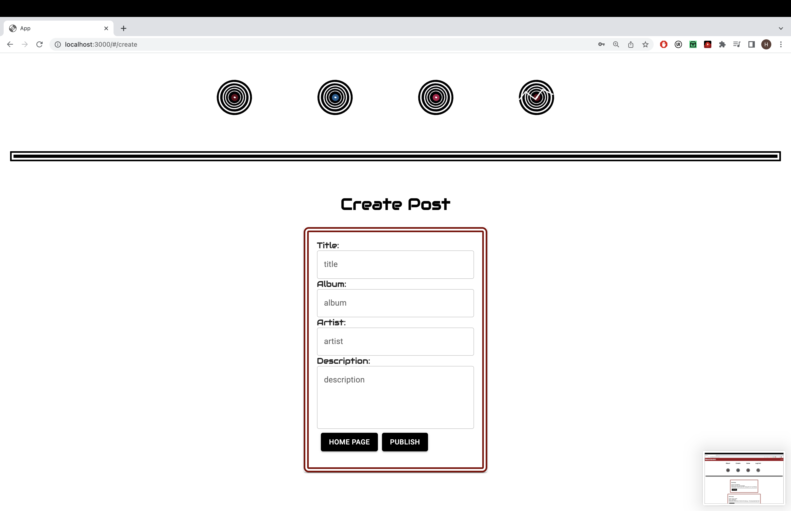
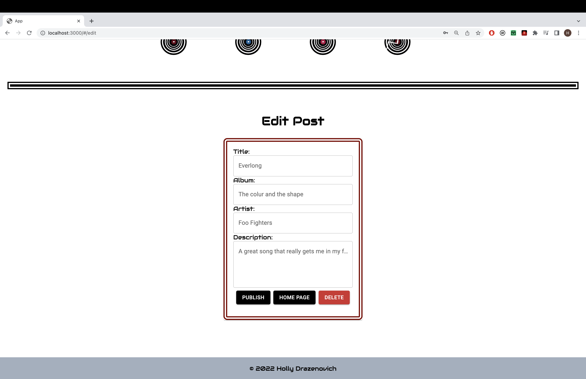

# Record Scratch 
Record Scratch was created to provided users the ability to share and see new music recommendations from your friends and family! Users can create, edit, delete, and read posts that may help you find your next new favorite song! 

## ScreenShots

# Prerequisites: 
- Node.js 
- Nodemon 
- PostgreSQL

# Installation 
Begin by creating a database titled "prime_app" After database is created user can copy paste info from the database.sql.  Run npm  server in your terminal, run npm run client in your terminal, then npm run client command will open up a new browser tab for you!

# USAGE:

1.First Sign into app or register for an account 

2. User will be brought to the homepage where they may view all previous posts 

3. User can select the record labeled "create" and can view the create page

4. On the  create page user will be prompted to enter information for their song of choice 

5. Once the user hit post the post will be added to the database and will also appear on the homepage 

6. One the homepage can also see that there is an edit button on all their posts - 

7. Once the edit button is clicked the user will be brought to the edit page that has the corresponding information for that post 

## Acknowledgments:

Thank you to Prime Academy for equipping us with the information to make this app a reality. My teacher Chris Black for taking the time to teach me. My parents for always letting me talk about my passion for music even if they thought my music taste was odd.

